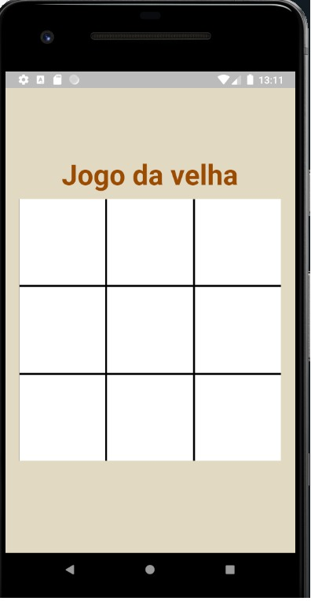
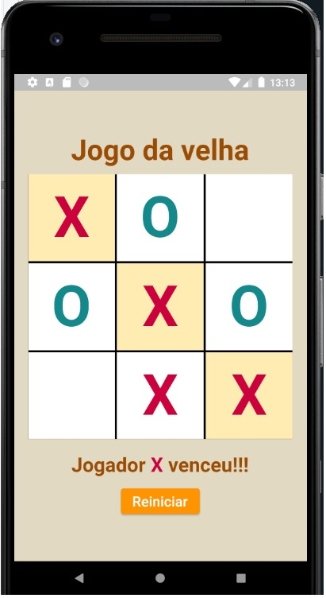
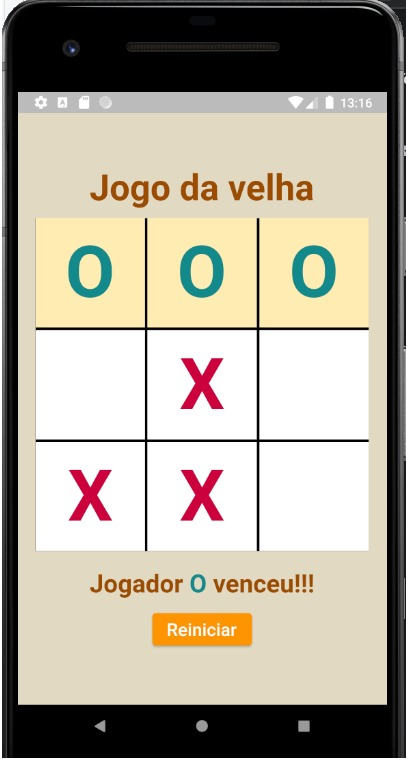
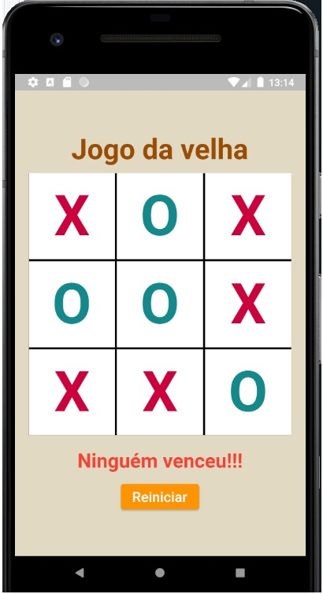

# Jogo da Velha em Flutter

Este é um simples jogo da velha construído em Flutter. </br>
É uma aplicação divertida e educativa para aprender Flutter e desenvolvimento de aplicativos móveis.







## Funcionalidades

- Jogue o clássico jogo da velha contra um amigo.
- Interface de usuário intuitiva e amigável.
- Vitória automática e detecção de empate.
- Reiniciar o jogo a qualquer momento.

## Como usar

1. Clone este repositório para o seu computador:

```bash
git clone https://github.com/LipCam/jogo_da_velha_ft.git
